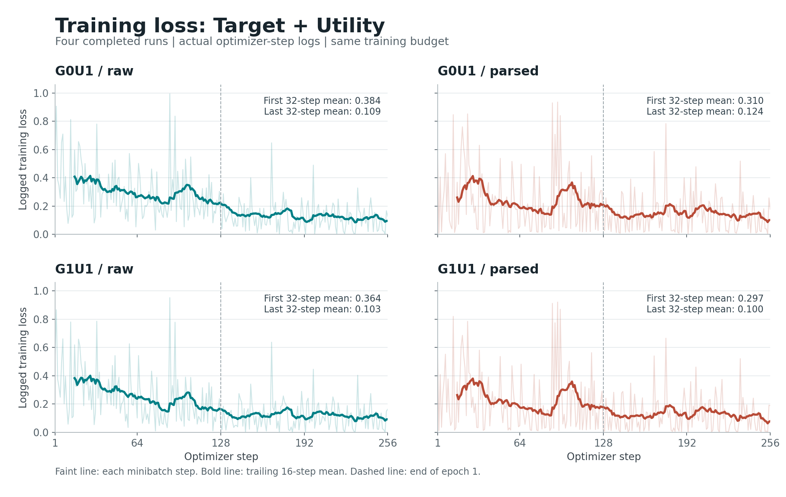
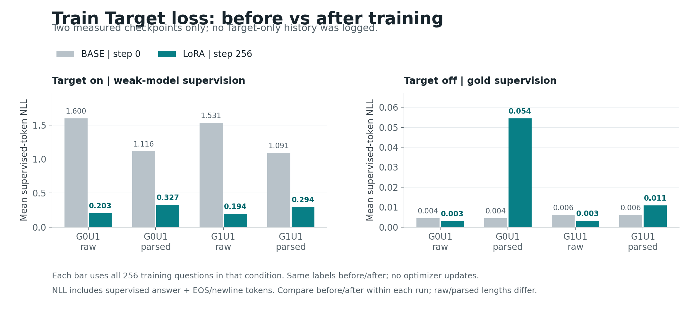

# E1：Loss 诊断

总体训练 loss 确实下降，训练 Target on 的监督 loss 也下降了。但低 loss 不等于模型已经在 Dev 上学会按 Gate 降级，也不能单凭这两张图断言过拟合。

## 总体训练曲线

这是原始日志的 256 个训练步，混合了 Target/Utility 和 on/off。浅线是每步 loss，粗线是过去 16 步均值；虚线为第一个 epoch 结束。不是 Target 专属曲线。

| 模型 | 前 32 步平均 loss | 后 32 步平均 loss |
| --- | ---: | ---: |
| G0U1-raw | 0.384 | 0.109 |
| G0U1-parsed | 0.310 | 0.124 |
| G1U1-raw | 0.364 | 0.103 |
| G1U1-parsed | 0.297 | 0.100 |

## 训练 Target 专项

原训练没有记录 Target 专属 loss，而且只保存了最后的 checkpoint，因此不能还原完整的 Target loss 历史曲线。下图是补测的训练前 BASE 与训练后 LoRA 两个端点，没有连线或插值，也没有重新训练。

| 模型 | Target on：训练前 → 后 | Target off：训练前 → 后 |
| --- | ---: | ---: |
| G0U1-raw | 1.5997 → 0.2033 | 0.0045 → 0.0030 |
| G0U1-parsed | 1.1160 → 0.3269 | 0.0045 → 0.0545 |
| G1U1-raw | 1.5306 → 0.1936 | 0.0061 → 0.0031 |
| G1U1-parsed | 1.0915 → 0.2941 | 0.0061 → 0.0108 |

Target on 按实际弱模型训练标签计 loss；Target off 按 gold 计 loss。每个条件都使用相同的 256 道训练题、相同监督文本，对比训练前后。
这里 loss 是所有受监督 token 的平均负对数概率（NLL）：只计回答、EOS 与末尾换行，不计题目和空 think 前缀。raw 和 parsed 的监督文本长度不同，因此重点比较同一模式的前后变化。
这是固定数据、eval 模式下的补测 NLL，不是训练日志中的混合 minibatch loss，也不是自由生成准确率。每次模型前向的首个 batch 已与模型内置 loss 核对一致。

仅运行了前向计算，没有 optimizer 更新。BASE 中相同输入已合并复用；未使用 Dev、CAL、Q3-Test 或 Q4-Test。原始记录和按条缓存留在私有 runtime，本目录只发布数值、哈希和图片。
完整逐步数值、端点计数与测量配置见 [loss-diagnostics.json](loss-diagnostics.json)。
